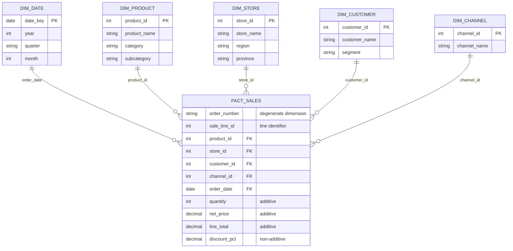

# Trace d'usage IA — GIS805

> Chaque interaction significative avec un outil IA doit être documentée ici.
> Ce fichier est **obligatoire** et évalué à chaque remise.

## Format par entrée

```
### YYYY-MM-DD — Séance SXX
- **Modèle :** (ChatGPT-4o, Claude, Copilot, etc.)
- **Prompt :** (copier-coller exact)
- **Résultat :** (résumé de ce que l'IA a produit)
- **Validation :** (comment vous avez vérifié/modifié le résultat)
- **Justification :** (pourquoi cette interaction était nécessaire)
```

---

<!-- Ajoutez vos entrées ci-dessous -->
### 2026-05-10 - séance S01
- **modèle :** GitHub  Copilot chat
- **prompt :**  "c'est quoi la différence entre c'est 03 commandes?"
- **Resultat :**make generate : Génère vos données fictives uniques (fichiers CSV dans synthetic) à partir de scripts Python, en simulant des ventes, clients et produits pour NexaMart. C'est la base pour tout le cours — sans cela, pas de données à analyser.

make load : Charge ces CSV dans DuckDB (votre entrepôt), créant des tables brutes (staging) prêtes pour les transformations Kimball. Cela transforme les fichiers plats en base de données relationnelle.

make check : Exécute des vérifications automatiques (dans validation) pour s'assurer que les données chargées sont cohérentes (ex. : pas de valeurs nulles critiques, clés uniques). Si tout passe, vous avez un environnement propre pour le diagnostic.

- **Validation :** J'ai comparé la réponse avec le resultat de mon exécution de commande
- **Justification :** je voulais comprendre le fonctionnement de ces commandes

- **modèle :** GitHub  Copilot chat
- **prompt :** mais lorsque j'ai fait le make generate je n'ai pas dans la trace les fichiers cvs raw_..."
- **Resultat :**Les fichiers CSV générés par make generate sont nommés avec le préfixe dim_ (ex. : dim_customer.csv, dim_product.csv) et placés dans data/synthetic/team_<votre_seed>/shared/, pas raw_. Ils simulent les données brutes des systèmes OLTP (dimensions de base pour clients, produits, dates, etc.), sans les faits de ventes encore.

Si vous ne les voyez pas dans la trace du terminal, c'est normal — make generate écrit silencieusement les fichiers. Vérifiez le dossier shared : vous devriez y trouver dim_channel.csv, dim_customer.csv, etc.

Pour le diagnostic S01, ces dimensions représentent les "systèmes opérationnels" : ils enregistrent les entités (clients, produits), mais pas les mesures analytiques (ventes par région/catégorie).

- **Validation :** j'ai parcourru les répertoires listés pour avoir les mêmes informations fournies par l'agent
- **Justification :** je voulais comprendre comment et où proviennent les données générées

- **modèle :** GitHub  Copilot chat
- **prompt :** "mais lorsque je fais le load, j'ai des fichiers raw_... qui sont chargés dans duckdb, d'ou viennent-ils?"
- **Resultat :**D’où viennent les raw_... ?
Quand vous lancez make load, le pipeline Python dans run_pipeline.py fait ceci :

Il parcourt tous les CSV sous synthetic
Pour chaque fichier *.csv, il calcule un nom de table DuckDB :
dim_customer.csv → raw_dim_customer
fact_sales.csv → raw_fact_sales
Il crée dans nexamart.duckdb une table DuckDB raw_<stem> en important le CSV avec read_csv_auto(...)
Donc :

raw_dim_customer n’est pas un fichier sur disque
c’est une table DuckDB créée automatiquement à partir de data/synthetic/.../dim_customer.csv

- **Validation :** j'ai parcourru les répertoires listés pour avoir les mêmes informations fournies par l'agent
- **Justification :** je voulais comprendre comment et où proviennent les données générées


- **modèle :** GitHub  Copilot chat
- **prompt :** " maintenant on va poursuivre avec notre diagnostique des données transactionnelles pour répondre à la question du CEO. quel est le plan que tu me proposes? est ce qu'on ne va pas commencer pas bien comprendre la question du CEO avant de d'aller en profondeur dans le diagnostique"
- **Resultat :** Oui, commencer par bien comprendre la question du CEO est essentiel : cela définit ce que tu cherches dans les données, avant de plonger dans le diagnostic. La question est "Quelles catégories déclinent dans quelles régions et pourquoi ?", ce qui se traduit en Kimball par :

Mesure : déclin des ventes (additive, par trimestre).
Dimensions : catégorie (produit), région (magasin), temps (trimestre).
Pourquoi : causes possibles (promo, retours, stock, etc.).
Plan proposé pour ton diagnostic S01
Clarifier la question : Reformule-la en termes de mesures/dimensions/hiérarchies. (2-3 min)
Inventorier les tables brutes : Liste les raw_* disponibles et leurs colonnes clés. (5 min)
Tester les dimensions : Vérifie si catégorie, région, trimestre existent et sont normalisées. (5 min)
Évaluer les mesures et jointures : Vois si les ventes sont jointables et si des causes sont présentes. (5 min)
Faire un test agrégé : Essaie une requête simple pour voir si la réponse partielle est possible. (5 min)
Rédiger le diagnostic : Note ce qui fonctionne, ce qui manque, et recommande le modèle Kimball. (5 min)

- **Validation :** exécution des requêtes fournies
SHOW TABLES;
DESCRIBE raw_dim_product;
DESCRIBE raw_dim_store;
DESCRIBE raw_dim_date;
DESCRIBE raw_fact_sales;

SELECT DISTINCT category FROM raw_dim_product;
SELECT DISTINCT region FROM raw_dim_store;
SELECT DISTINCT quarter FROM raw_dim_date ORDER BY quarter;

SELECT COUNT(*) FROM raw_fact_sales;
SELECT COUNT(*) FROM raw_fact_sales WHERE product_id NOT IN (SELECT product_id FROM raw_dim_product);

SELECT p.category, s.region, d.quarter, SUM(f.line_total) AS revenue
FROM raw_fact_sales f
JOIN raw_dim_product p ON p.product_id = f.product_id
JOIN raw_dim_store s ON s.store_id = f.store_id
JOIN raw_dim_date d ON d.date_key = f.order_date
GROUP BY p.category, s.region, d.quarter
ORDER BY revenue DESC
LIMIT 10;
- **Justification :** être sûre que les donnons contiennent tous les éléments nécessaires pour la réponse à question du CEO


### 2026-05-17 - séance S02
- **modèle :** Codex basé sur GPT-5
- **prompt :**  "tu peux m'expliquer le fichier s02-sample-brief.md"
- **Resultat :** Oui. Ce fichier docs/s02-sample-brief.md est un exemple annoté du brief attendu pour la séance S02. Ce n’est pas le fichier à rendre : ton vrai livrable est indiqué au début, dans answers/S02_executive_brief.md.
Le but du brief est de répondre à la question du CEO :
Quelles catégories de produits déclinent dans quelles régions, par trimestre ?
Le document montre la structure attendue :
Grain statement
Il faut définir précisément ce que représente une ligne de la table de faits.
Ici : 1 ligne = 1 ligne de commande, identifiée par (order_number, sale_line_id).
C’est important parce que toutes les mesures SQL doivent être cohérentes avec ce niveau de détail.

Étoile construite
Le fichier donne un exemple de schéma en étoile avec une table centrale FACT_SALES et 5 dimensions :
DIM_DATE, DIM_PRODUCT, DIM_STORE, DIM_CUSTOMER, DIM_CHANNEL.
La table de faits contient les mesures comme :
quantity
net_price
line_total
discount_pct
Il précise aussi quelles mesures sont additives ou non. Par exemple, line_total peut être additionné, mais discount_pct ne doit pas être simplement additionné.

SQL preuve
La requête SQL sert à prouver que le modèle répond bien à la question du CEO.
Elle regroupe les ventes par :
catégorie produit
région
trimestre
Puis elle calcule :
le revenu total avec SUM(f.line_total)
le nombre de lignes avec COUNT(*)

Réponse au CEO
La dernière section traduit les résultats en langage business.
Au lieu de seulement montrer du SQL, elle explique ce qu’on observe et propose une action concrète.

En gros, ce fichier est un modèle de ce qu’il faut produire : définition du grain, schéma en étoile, requête SQL qui répond à la question, puis conclusion business courte. Les annotations [-> ...] expliquent pourquoi chaque partie est bien faite.

- **Validation :** J'ai comparé avec le contenu du fichier
- **Justification :** je voulais comprendre ce que je dois faire

- **modèle :** Codex avec chat GPT
- **prompt :** "voici mon grain : **1 ligne = 1 ligne de commande** identifiée par (order_number, sale_line_id) concernant un produit,effectuée par un client dans un magasin par un canal de vente à une date donnée. , *« Génère un diagramme Mermaid erDiagram pour mon étoile NexaMart.
> Au centre : FACT_SALES au grain « une ligne de commande »
> (order_number + sale_line_id), avec les mesures quantity, net_price,
> line_total, discount_pct. Cinq dimensions reliées par FK :
> dim_date, dim_product, dim_store, dim_customer, dim_channel.
> Inclus le bloc dans un fichier Markdown. »*"
- **Resultat :**


- **Validation :** j'ai comparé avec celui attendu
- **Justification :** je voulais me rassurer que mon modèle soit cohérent

- **modèle :** Codex basé sur GPT-5
- **prompt :** "tu vois mon fichier 01_dimfrom_raw.sql? j'aimerais que tu me crées et adaptes ces fichiers pour chacune de ces dimensions : dim_product, dim_customer, dim_store, dim_date,
dim_channel dans le repertoire dims"
- **Resultat :**C’est fait. J’ai créé les 5 fichiers dans sql/dims :
dim_product.sql
dim_customer.sql
dim_store.sql
dim_date.sql
dim_channel.sql
Chaque fichier crée sa table dim_* à partir de la table raw_dim_*, ajoute une clé substitut quand c’est pertinent, conserve la clé naturelle, ajoute loaded_at, puis exécute deux vérifications : unicité de la clé et absence de clé naturelle nulle.
J’ai aussi testé les 5 scripts sur une copie temporaire de ta base DuckDB : tous les checks retournent PASS.

- **Validation :** j'ai parcourru les répertoires listés pour avoir les mêmes informations fournies par l'agent
- **Justification :** je voulais me rassurer que les fichiers soient créés sans erreurs

- **modèle :** Codex basé sur GPT-5
- **prompt :** " j'ai une question, est ce que CURRENT_DATE                            AS loaded_at est nécessaire pour toute les tables?"
- **Resultat :** Non, ce n’est pas strictement nécessaire pour toutes les tables.

CURRENT_DATE AS loaded_at sert surtout à garder une trace de la date à laquelle la dimension a été chargée ou reconstruite. C’est une colonne technique utile pour l’audit, le debugging, ou pour savoir “quand cette table a été générée”.

Dans ton contexte S02, tu peux la garder dans toutes les dimensions : c’est propre, cohérent, et ça montre une bonne pratique de pipeline.

Mais côté modèle métier, elle n’est pas indispensable. Les dimensions pourraient fonctionner parfaitement sans loaded_at:

- **Validation :** pas de validation
- **Justification :** juste pour me rassurer de la necessité de  cette colonne ou champ dans toutesles dimensions

- **modèle :** Codex basé sur GPT-5
- **prompt :** " make load"
- **Resultat :** python src/run_pipeline.py

-- Loading 24 CSVs into DuckDB --

  raw_fact_sales                              2,147 rows  <- data/synthetic/team_1802767793/s06/fact_sales.csv
  raw_customer_changes                          122 rows  <- data/synthetic/team_1802767793/s03/customer_changes.csv
  raw_store_changes                               5 rows  <- data/synthetic/team_1802767793/s03/store_changes.csv
  raw_order_lines                             1,904 rows  <- data/synthetic/team_1802767793/s04/order_lines.csv
  raw_orders                                    690 rows  <- data/synthetic/team_1802767793/s04/orders.csv
  raw_fact_budget                             1,200 rows  <- data/synthetic/team_1802767793/s06/fact_budget.csv
  raw_fact_inventory_snapshot                 5,671 rows  <- data/synthetic/team_1802767793/s06/fact_inventory_snapshot.csv
  raw_fact_returns                              168 rows  <- data/synthetic/team_1802767793/s06/fact_returns.csv
  raw_customer_profile_bands                    159 rows  <- data/synthetic/team_1802767793/s07/customer_profile_bands.csv
  raw_dim_geography                              11 rows  <- data/synthetic/team_1802767793/s07/dim_geography.csv
  raw_fact_shipment                             903 rows  <- data/synthetic/team_1802767793/s07/fact_shipment.csv
  raw_bridge_campaign_allocation                 22 rows  <- data/synthetic/team_1802767793/s08/bridge_campaign_allocation.csv
  raw_bridge_customer_segment                   235 rows  <- data/synthetic/team_1802767793/s08/bridge_customer_segment.csv
  raw_customer_scd3_history                     159 rows  <- data/synthetic/team_1802767793/s08/customer_scd3_history.csv
  raw_dim_segment_outrigger                       6 rows  <- data/synthetic/team_1802767793/s08/dim_segment_outrigger.csv
  raw_fact_daily_inventory                    1,500 rows  <- data/synthetic/team_1802767793/s09/fact_daily_inventory.csv
  raw_fact_order_pipeline                       712 rows  <- data/synthetic/team_1802767793/s09/fact_order_pipeline.csv
  raw_fact_orders_transaction                 1,105 rows  <- data/synthetic/team_1802767793/s09/fact_orders_transaction.csv
  raw_fact_promo_exposure                        75 rows  <- data/synthetic/team_1802767793/s09/fact_promo_exposure.csv
  raw_dim_channel                                 5 rows  <- data/synthetic/team_1802767793/shared/dim_channel.csv
  raw_dim_customer                              159 rows  <- data/synthetic/team_1802767793/shared/dim_customer.csv
  raw_dim_date                                  731 rows  <- data/synthetic/team_1802767793/shared/dim_date.csv
  raw_dim_product                                50 rows  <- data/synthetic/team_1802767793/shared/dim_product.csv
  raw_dim_store                                  10 rows  <- data/synthetic/team_1802767793/shared/dim_store.csv
  OK sql/dims/dim_channel.sql
  OK sql/dims/dim_customer.sql
  OK sql/dims/dim_date.sql
  OK sql/dims/dim_product.sql
  OK sql/dims/dim_store.sql
  (5 file(s) from sql/dims/)

============================================================
  29 tables in db/nexamart.duckdb
============================================================
  dim_channel                                     5 rows
  dim_customer                                  159 rows
  dim_date                                      731 rows
  dim_product                                    50 rows
  dim_store                                      10 rows
  raw_bridge_campaign_allocation                 22 rows
  raw_bridge_customer_segment                   235 rows
  raw_customer_changes                          122 rows
  raw_customer_profile_bands                    159 rows
  raw_customer_scd3_history                     159 rows
  raw_dim_channel                                 5 rows
  raw_dim_customer                              159 rows
  raw_dim_date                                  731 rows
  raw_dim_geography                              11 rows
  raw_dim_product                                50 rows
  raw_dim_segment_outrigger                       6 rows
  raw_dim_store                                  10 rows
  raw_fact_budget                             1,200 rows
  raw_fact_daily_inventory                    1,500 rows
  raw_fact_inventory_snapshot                 5,671 rows
  raw_fact_order_pipeline                       712 rows
  raw_fact_orders_transaction                 1,105 rows
  raw_fact_promo_exposure                        75 rows
  raw_fact_returns                              168 rows
  raw_fact_sales                              2,147 rows
  raw_fact_shipment                             903 rows
  raw_order_lines                             1,904 rows
  raw_orders                                    690 rows
  raw_store_changes                               5 rows

Done. Database: db/nexamart.duckdb
@NoumSandji ➜ /workspaces/onboarding-gis805-v2-NoumSandji (main) $ make check
python src/run_checks.py
============================================
NexaMart Validation: 15 PASS, 8 FAIL, 9 SKIP
============================================

[PASS]  TABLE_EXISTS     dim_date                                       PASS
[PASS]  TABLE_EXISTS     dim_product                                    PASS
[PASS]  TABLE_EXISTS     dim_store                                      PASS
[PASS]  TABLE_EXISTS     dim_customer                                   PASS
[PASS]  TABLE_EXISTS     dim_channel                                    PASS
[FAIL]  TABLE_EXISTS     fact_sales                                     FAIL -- table not present
[FAIL]  TABLE_EXISTS     fact_returns                                   FAIL -- table not present
[FAIL]  TABLE_EXISTS     fact_budget                                    FAIL -- table not present
[FAIL]  TABLE_EXISTS     fact_daily_inventory                           FAIL -- table not present
[FAIL]  TABLE_EXISTS     fact_order_pipeline                            FAIL -- table not present
[FAIL]  TABLE_EXISTS     bridge_customer_segment                        FAIL -- table not present
[FAIL]  TABLE_EXISTS     junk_order_profile                             FAIL -- table not present
[FAIL]  TABLE_EXISTS     fact_promo_exposure                            FAIL -- table not present
[PASS]  ROW_COUNT        dim_date                                       PASS
[PASS]  ROW_COUNT        dim_product                                    PASS
[PASS]  ROW_COUNT        dim_store                                      PASS
[PASS]  ROW_COUNT        dim_channel                                    PASS
[PASS]  ROW_COUNT        dim_customer                                   PASS
[SKIP]  MISSING_TABLE    Catalog Error: Table with name fact_sales does not exist!
[PASS]  PK_UNIQUE        dim_date.date_key                              PASS
[PASS]  PK_UNIQUE        dim_product.product_id                         PASS
[PASS]  PK_UNIQUE        dim_store.store_id                             PASS
[PASS]  PK_UNIQUE        dim_channel.channel_id                         PASS
[PASS]  PK_UNIQUE        dim_customer.customer_key                      PASS
[SKIP]  ERROR            Binder Error: Referenced column "is_current" not found in FROM clause!
[SKIP]  MISSING_TABLE    Catalog Error: Table with name fact_sales does not exist!
[SKIP]  MISSING_TABLE    Catalog Error: Table with name fact_sales does not exist!
[SKIP]  MISSING_TABLE    Catalog Error: Table with name fact_sales does not exist!
[SKIP]  MISSING_TABLE    Catalog Error: Table with name fact_sales does not exist!
[SKIP]  MISSING_TABLE    Catalog Error: Table with name fact_sales does not exist!
[SKIP]  MISSING_TABLE    Catalog Error: Table with name fact_sales does not exist!
[SKIP]  MISSING_TABLE    Catalog Error: Table with name bridge_customer_segment does not exist!

Results saved to validation/results/check_results.txt
make: *** [Makefile:43: check] Error 1

- **Validation :** make check
- **Justification :** pour me rassurer que les tables de dimensions existent
python src/run_checks.py
============================================
NexaMart Validation: 15 PASS, 8 FAIL, 9 SKIP
============================================

[PASS]  TABLE_EXISTS     dim_date                                       PASS
[PASS]  TABLE_EXISTS     dim_product                                    PASS
[PASS]  TABLE_EXISTS     dim_store                                      PASS
[PASS]  TABLE_EXISTS     dim_customer                                   PASS
[PASS]  TABLE_EXISTS     dim_channel                                    PASS
[FAIL]  TABLE_EXISTS     fact_sales                                     FAIL -- table not present
[FAIL]  TABLE_EXISTS     fact_returns                                   FAIL -- table not present
[FAIL]  TABLE_EXISTS     fact_budget                                    FAIL -- table not present
[FAIL]  TABLE_EXISTS     fact_daily_inventory                           FAIL -- table not present
[FAIL]  TABLE_EXISTS     fact_order_pipeline                            FAIL -- table not present
[FAIL]  TABLE_EXISTS     bridge_customer_segment                        FAIL -- table not present
[FAIL]  TABLE_EXISTS     junk_order_profile                             FAIL -- table not present
[FAIL]  TABLE_EXISTS     fact_promo_exposure                            FAIL -- table not present
[PASS]  ROW_COUNT        dim_date                                       PASS
[PASS]  ROW_COUNT        dim_product                                    PASS
[PASS]  ROW_COUNT        dim_store                                      PASS
[PASS]  ROW_COUNT        dim_channel                                    PASS
[PASS]  ROW_COUNT        dim_customer                                   PASS
[SKIP]  MISSING_TABLE    Catalog Error: Table with name fact_sales does not exist!
[PASS]  PK_UNIQUE        dim_date.date_key                              PASS
[PASS]  PK_UNIQUE        dim_product.product_id                         PASS
[PASS]  PK_UNIQUE        dim_store.store_id                             PASS
[PASS]  PK_UNIQUE        dim_channel.channel_id                         PASS
[PASS]  PK_UNIQUE        dim_customer.customer_key                      PASS
[SKIP]  ERROR            Binder Error: Referenced column "is_current" not found in FROM clause!
[SKIP]  MISSING_TABLE    Catalog Error: Table with name fact_sales does not exist!
[SKIP]  MISSING_TABLE    Catalog Error: Table with name fact_sales does not exist!
[SKIP]  MISSING_TABLE    Catalog Error: Table with name fact_sales does not exist!
[SKIP]  MISSING_TABLE    Catalog Error: Table with name fact_sales does not exist!
[SKIP]  MISSING_TABLE    Catalog Error: Table with name fact_sales does not exist!
[SKIP]  MISSING_TABLE    Catalog Error: Table with name fact_sales does not exist!
[SKIP]  MISSING_TABLE    Catalog Error: Table with name bridge_customer_segment does not exist!

Results saved to validation/results/check_results.txt
make: *** [Makefile:43: check] Error 1

- **modèle :** Codex basé sur GPT-5
- **prompt :** " est ce que qu'il y a une clé dans raw_fact_sale qui va nous permettre de relier la dim_promo avec fact_sales"
- **Resultat :**Bonne question. Non, pas vraiment.

Dans raw_fact_sales, les colonnes sont :

sale_line_id
order_number
order_date
customer_id
product_id
store_id
channel_id
quantity
unit_price
discount_pct
net_price
line_total
Il n’y a pas de promo_id, pas de campaign_id, pas de promo_key. Donc il n’y a pas de vraie clé naturelle qui relie proprement fact_sales à une dim_promo.

La seule colonne liée aux promotions est :

discount_pct
Mais discount_pct est une mesure / attribut numérique, pas une vraie clé de dimension. On pourrait techniquement créer une dim_promo à partir des valeurs distinctes de discount_pct, puis relier fact_sales.discount_pct à dim_promo.discount_pct, mais ce serait un peu artificiel.

Exemple possible, mais moins propre :

JOIN dim_promo p
  ON f.discount_pct = p.discount_pct
Pour un modèle S02 propre, je te conseille plutôt de ne pas ajouter dim_promo à fact_sales pour l’instant.

Dans ton diagramme Mermaid, garde seulement :

dim_date
dim_product
dim_store
dim_customer
dim_channel
Et laisse discount_pct comme mesure non-additive dans FACT_SALES.

- **Validation :** j'ai parcourru les colonnes de la table raw_fact_sales pour me rassurer qu'il n'y a pas de colonne permettant de faire une jointure avec la dimension dim_promo
- **Justification :** je voulais me rassurer de l'existence de la relation entre les deux tables fact_sales et dim_promo

**modèle :** Codex basé sur GPT-5
- **prompt :** " tu lis mon fichier 02_fact_with_grain.sql, j'aimerais l'utiliser pour créer ma table de fait"
- **Resultat :** J’ai créé ta table de fait ici : fact_sales.sql.
Elle reprend le grain du template :
sql


-- GRAIN : one row = one order line identified by
--         (order_number, sale_line_id)

Elle construit fact_sales depuis raw_fact_sales, puis joint tes dimensions :
dim_date → date_key
dim_customer → customer_key
dim_product → product_key
dim_store → store_key
dim_channel → channel_key
Elle garde aussi les clés naturelles (customer_id, product_id, etc.) pour la traçabilité, et ajoute les mesures :
quantity
unit_price
discount_pct
net_price
line_total
gross_amount
margin_amount
Je l’ai testée sur une copie temporaire de la base : tout passe.
text


fact_sales_grain_unique          PASS
fact_sales_no_null_keys          PASS
fact_sales_reconcile_rowcount    2147 / 2147 PASS
fact_sales_non_negative_measures PASS

Tu peux maintenant lancer :
bash


make load
make check

en t’assurant d’abord que la base DuckDB n’est pas ouverte dans VS Code.

- **Validation :** j'ai vérifié le fichier a été crée
- **Justification :** pour me rassurer que le script soit sans erreur

- **modèle :** Codex basé sur GPT-5
- **prompt :** " est ce que qu'il y a une clé dans raw_fact_sale qui va nous permettre de relier la dim_promo avec fact_sales"
- **Resultat :**Bonne question. Non, pas vraiment.

Dans raw_fact_sales, les colonnes sont :

sale_line_id
order_number
order_date
customer_id
product_id
store_id
channel_id
quantity
unit_price
discount_pct
net_price
line_total
Il n’y a pas de promo_id, pas de campaign_id, pas de promo_key. Donc il n’y a pas de vraie clé naturelle qui relie proprement fact_sales à une dim_promo.

La seule colonne liée aux promotions est :

discount_pct
Mais discount_pct est une mesure / attribut numérique, pas une vraie clé de dimension. On pourrait techniquement créer une dim_promo à partir des valeurs distinctes de discount_pct, puis relier fact_sales.discount_pct à dim_promo.discount_pct, mais ce serait un peu artificiel.

Exemple possible, mais moins propre :

JOIN dim_promo p
  ON f.discount_pct = p.discount_pct
Pour un modèle S02 propre, je te conseille plutôt de ne pas ajouter dim_promo à fact_sales pour l’instant.

Dans ton diagramme Mermaid, garde seulement :

dim_date
dim_product
dim_store
dim_customer
dim_channel
Et laisse discount_pct comme mesure non-additive dans FACT_SALES.

- **Validation :** j'ai parcourru les colonnes de la table raw_fact_sales pour me rassurer qu'il n'y a pas de colonne permettant de faire une jointure avec la dimension dim_promo
- **Justification :** je voulais me rassurer de l'existence de la relation entre les deux tables fact_sales et dim_promo

**modèle :** Codex basé sur GPT-5
- **prompt :** " tu lis mon fichier 02_fact_with_grain.sql, j'aimerais l'utiliser pour créer ma table de fait"
- **Resultat :** J’ai créé ta table de fait ici : fact_sales.sql.
Elle reprend le grain du template :
sql


-- GRAIN : one row = one order line identified by
--         (order_number, sale_line_id)

Elle construit fact_sales depuis raw_fact_sales, puis joint tes dimensions :
dim_date → date_key
dim_customer → customer_key
dim_product → product_key
dim_store → store_key
dim_channel → channel_key
Elle garde aussi les clés naturelles (customer_id, product_id, etc.) pour la traçabilité, et ajoute les mesures :
quantity
unit_price
discount_pct
net_price
line_total
gross_amount
margin_amount
Je l’ai testée sur une copie temporaire de la base : tout passe.
text


fact_sales_grain_unique          PASS
fact_sales_no_null_keys          PASS
fact_sales_reconcile_rowcount    2147 / 2147 PASS
fact_sales_non_negative_measures PASS

Tu peux maintenant lancer :
bash


make load
make check

en t’assurant d’abord que la base DuckDB n’est pas ouverte dans VS Code.

- **Validation :** j'ai vérifié le fichier a été crée
- **Justification :** pour me rassurer que le script soit sans erreur

**modèle :** Codex basé sur GPT-5
- **prompt :** "make load, make check"
- **Resultat :**  make load
python src/run_pipeline.py

-- Loading 24 CSVs into DuckDB --

  raw_fact_sales                              2,147 rows  <- data/synthetic/team_1802767793/s06/fact_sales.csv
  raw_customer_changes                          122 rows  <- data/synthetic/team_1802767793/s03/customer_changes.csv
  raw_store_changes                               5 rows  <- data/synthetic/team_1802767793/s03/store_changes.csv
  raw_order_lines                             1,904 rows  <- data/synthetic/team_1802767793/s04/order_lines.csv
  raw_orders                                    690 rows  <- data/synthetic/team_1802767793/s04/orders.csv
  raw_fact_budget                             1,200 rows  <- data/synthetic/team_1802767793/s06/fact_budget.csv
  raw_fact_inventory_snapshot                 5,671 rows  <- data/synthetic/team_1802767793/s06/fact_inventory_snapshot.csv
  raw_fact_returns                              168 rows  <- data/synthetic/team_1802767793/s06/fact_returns.csv
  raw_customer_profile_bands                    159 rows  <- data/synthetic/team_1802767793/s07/customer_profile_bands.csv
  raw_dim_geography                              11 rows  <- data/synthetic/team_1802767793/s07/dim_geography.csv
  raw_fact_shipment                             903 rows  <- data/synthetic/team_1802767793/s07/fact_shipment.csv
  raw_bridge_campaign_allocation                 22 rows  <- data/synthetic/team_1802767793/s08/bridge_campaign_allocation.csv
  raw_bridge_customer_segment                   235 rows  <- data/synthetic/team_1802767793/s08/bridge_customer_segment.csv
  raw_customer_scd3_history                     159 rows  <- data/synthetic/team_1802767793/s08/customer_scd3_history.csv
  raw_dim_segment_outrigger                       6 rows  <- data/synthetic/team_1802767793/s08/dim_segment_outrigger.csv
  raw_fact_daily_inventory                    1,500 rows  <- data/synthetic/team_1802767793/s09/fact_daily_inventory.csv
  raw_fact_order_pipeline                       712 rows  <- data/synthetic/team_1802767793/s09/fact_order_pipeline.csv
  raw_fact_orders_transaction                 1,105 rows  <- data/synthetic/team_1802767793/s09/fact_orders_transaction.csv
  raw_fact_promo_exposure                        75 rows  <- data/synthetic/team_1802767793/s09/fact_promo_exposure.csv
  raw_dim_channel                                 5 rows  <- data/synthetic/team_1802767793/shared/dim_channel.csv
  raw_dim_customer                              159 rows  <- data/synthetic/team_1802767793/shared/dim_customer.csv
  raw_dim_date                                  731 rows  <- data/synthetic/team_1802767793/shared/dim_date.csv
  raw_dim_product                                50 rows  <- data/synthetic/team_1802767793/shared/dim_product.csv
  raw_dim_store                                  10 rows  <- data/synthetic/team_1802767793/shared/dim_store.csv
  OK sql/dims/dim_channel.sql
  OK sql/dims/dim_customer.sql
  OK sql/dims/dim_date.sql
  OK sql/dims/dim_product.sql
  OK sql/dims/dim_store.sql
  (5 file(s) from sql/dims/)
  OK sql/facts/fact_sales.sql
  (1 file(s) from sql/facts/)

============================================================
  30 tables in db/nexamart.duckdb
============================================================
  dim_channel                                     5 rows
  dim_customer                                  159 rows
  dim_date                                      731 rows
  dim_product                                    50 rows
  dim_store                                      10 rows
  fact_sales                                  2,147 rows
  raw_bridge_campaign_allocation                 22 rows
  raw_bridge_customer_segment                   235 rows
  raw_customer_changes                          122 rows
  raw_customer_profile_bands                    159 rows
  raw_customer_scd3_history                     159 rows
  raw_dim_channel                                 5 rows
  raw_dim_customer                              159 rows
  raw_dim_date                                  731 rows
  raw_dim_geography                              11 rows
  raw_dim_product                                50 rows
  raw_dim_segment_outrigger                       6 rows
  raw_dim_store                                  10 rows
  raw_fact_budget                             1,200 rows
  raw_fact_daily_inventory                    1,500 rows
  raw_fact_inventory_snapshot                 5,671 rows
  raw_fact_order_pipeline                       712 rows
  raw_fact_orders_transaction                 1,105 rows
  raw_fact_promo_exposure                        75 rows
  raw_fact_returns                              168 rows
  raw_fact_sales                              2,147 rows
  raw_fact_shipment                             903 rows
  raw_order_lines                             1,904 rows
  raw_orders                                    690 rows
  raw_store_changes                               5 rows

Done. Database: db/nexamart.duckdb
@NoumSandji ➜ /workspaces/onboarding-gis805-v2-NoumSandji (main) $ make check
python src/run_checks.py
============================================
NexaMart Validation: 22 PASS, 7 FAIL, 3 SKIP
============================================

[PASS]  TABLE_EXISTS     dim_date                                       PASS
[PASS]  TABLE_EXISTS     dim_product                                    PASS
[PASS]  TABLE_EXISTS     dim_store                                      PASS
[PASS]  TABLE_EXISTS     dim_customer                                   PASS
[PASS]  TABLE_EXISTS     dim_channel                                    PASS
[PASS]  TABLE_EXISTS     fact_sales                                     PASS
[FAIL]  TABLE_EXISTS     fact_returns                                   FAIL -- table not present
[FAIL]  TABLE_EXISTS     fact_budget                                    FAIL -- table not present
[FAIL]  TABLE_EXISTS     fact_daily_inventory                           FAIL -- table not present
[FAIL]  TABLE_EXISTS     fact_order_pipeline                            FAIL -- table not present
[FAIL]  TABLE_EXISTS     bridge_customer_segment                        FAIL -- table not present
[FAIL]  TABLE_EXISTS     junk_order_profile                             FAIL -- table not present
[FAIL]  TABLE_EXISTS     fact_promo_exposure                            FAIL -- table not present
[PASS]  ROW_COUNT        dim_date                                       PASS
[PASS]  ROW_COUNT        dim_product                                    PASS
[PASS]  ROW_COUNT        dim_store                                      PASS
[PASS]  ROW_COUNT        dim_channel                                    PASS
[PASS]  ROW_COUNT        dim_customer                                   PASS
[PASS]  ROW_COUNT        fact_sales                                     PASS
[PASS]  PK_UNIQUE        dim_date.date_key                              PASS
[PASS]  PK_UNIQUE        dim_product.product_id                         PASS
[PASS]  PK_UNIQUE        dim_store.store_id                             PASS
[PASS]  PK_UNIQUE        dim_channel.channel_id                         PASS
[PASS]  PK_UNIQUE        dim_customer.customer_key                      PASS
[SKIP]  ERROR            Binder Error: Referenced column "is_current" not found in FROM clause!
[PASS]  FK_NOT_NULL      fact_sales.product_key                         PASS
[PASS]  FK_NOT_NULL      fact_sales.store_key                           PASS
[PASS]  FK_NOT_NULL      fact_sales.customer_key                        PASS
[PASS]  FK_NOT_NULL      fact_sales.channel_key                         PASS
[PASS]  GRAIN_UNIQUE     fact_sales (order_number, sale_line_id)        PASS
[SKIP]  MISSING_TABLE    Catalog Error: Table with name fact_budget does not exist!
[SKIP]  MISSING_TABLE    Catalog Error: Table with name bridge_customer_segment does not exist!

Results saved to validation/results/check_results.txt
make: *** [Makefile:43: check] Error 1

- **Validation :** j'ai vérifié que les tables sont créées
- **Justification :** pour me rassurer que tout soit correct

**modèle :** Codex basé sur GPT-5
- **prompt :** "j'ai cette erreur ERROR            Binder Error: Referenced column "is_current" not found in FROM clause!"
- **Resultat :**  Oui, cette erreur vient de make check, pas de ta table de fait.
Le check cherche cette colonne dans dim_customer :
sql


is_current

Elle est normalement utilisée pour une dimension client historisée SCD Type 2. Comme ta dim_customer est encore une version simple S02, elle ne l’avait pas.
J’ai corrigé dim_customer.sql en ajoutant :
sql


CAST(join_date AS DATE) AS effective_from,
DATE '9999-12-31'       AS effective_to,
TRUE                    AS is_current,

Pour ton niveau actuel, ça veut dire : chaque client a une seule version, et elle est la version courante.
J’ai testé le check qui échouait : il retourne maintenant PASS.
Tu peux relancer :
bash


make load
make check

Toujours avec la base DuckDB fermée dans VS Code pour éviter l’erreur de verrou.
- **Validation :** exécution de make load et make check
$ make load
python src/run_pipeline.py

-- Loading 24 CSVs into DuckDB --

  raw_fact_sales                              2,147 rows  <- data/synthetic/team_1802767793/s06/fact_sales.csv
  raw_customer_changes                          122 rows  <- data/synthetic/team_1802767793/s03/customer_changes.csv
  raw_store_changes                               5 rows  <- data/synthetic/team_1802767793/s03/store_changes.csv
  raw_order_lines                             1,904 rows  <- data/synthetic/team_1802767793/s04/order_lines.csv
  raw_orders                                    690 rows  <- data/synthetic/team_1802767793/s04/orders.csv
  raw_fact_budget                             1,200 rows  <- data/synthetic/team_1802767793/s06/fact_budget.csv
  raw_fact_inventory_snapshot                 5,671 rows  <- data/synthetic/team_1802767793/s06/fact_inventory_snapshot.csv
  raw_fact_returns                              168 rows  <- data/synthetic/team_1802767793/s06/fact_returns.csv
  raw_customer_profile_bands                    159 rows  <- data/synthetic/team_1802767793/s07/customer_profile_bands.csv
  raw_dim_geography                              11 rows  <- data/synthetic/team_1802767793/s07/dim_geography.csv
  raw_fact_shipment                             903 rows  <- data/synthetic/team_1802767793/s07/fact_shipment.csv
  raw_bridge_campaign_allocation                 22 rows  <- data/synthetic/team_1802767793/s08/bridge_campaign_allocation.csv
  raw_bridge_customer_segment                   235 rows  <- data/synthetic/team_1802767793/s08/bridge_customer_segment.csv
  raw_customer_scd3_history                     159 rows  <- data/synthetic/team_1802767793/s08/customer_scd3_history.csv
  raw_dim_segment_outrigger                       6 rows  <- data/synthetic/team_1802767793/s08/dim_segment_outrigger.csv
  raw_fact_daily_inventory                    1,500 rows  <- data/synthetic/team_1802767793/s09/fact_daily_inventory.csv
  raw_fact_order_pipeline                       712 rows  <- data/synthetic/team_1802767793/s09/fact_order_pipeline.csv
  raw_fact_orders_transaction                 1,105 rows  <- data/synthetic/team_1802767793/s09/fact_orders_transaction.csv
  raw_fact_promo_exposure                        75 rows  <- data/synthetic/team_1802767793/s09/fact_promo_exposure.csv
  raw_dim_channel                                 5 rows  <- data/synthetic/team_1802767793/shared/dim_channel.csv
  raw_dim_customer                              159 rows  <- data/synthetic/team_1802767793/shared/dim_customer.csv
  raw_dim_date                                  731 rows  <- data/synthetic/team_1802767793/shared/dim_date.csv
  raw_dim_product                                50 rows  <- data/synthetic/team_1802767793/shared/dim_product.csv
  raw_dim_store                                  10 rows  <- data/synthetic/team_1802767793/shared/dim_store.csv
  OK sql/dims/dim_channel.sql
  OK sql/dims/dim_customer.sql
  OK sql/dims/dim_date.sql
  OK sql/dims/dim_product.sql
  OK sql/dims/dim_store.sql
  (5 file(s) from sql/dims/)
  OK sql/facts/fact_sales.sql
  (1 file(s) from sql/facts/)

============================================================
  30 tables in db/nexamart.duckdb
============================================================
  dim_channel                                     5 rows
  dim_customer                                  159 rows
  dim_date                                      731 rows
  dim_product                                    50 rows
  dim_store                                      10 rows
  fact_sales                                  2,147 rows
  raw_bridge_campaign_allocation                 22 rows
  raw_bridge_customer_segment                   235 rows
  raw_customer_changes                          122 rows
  raw_customer_profile_bands                    159 rows
  raw_customer_scd3_history                     159 rows
  raw_dim_channel                                 5 rows
  raw_dim_customer                              159 rows
  raw_dim_date                                  731 rows
  raw_dim_geography                              11 rows
  raw_dim_product                                50 rows
  raw_dim_segment_outrigger                       6 rows
  raw_dim_store                                  10 rows
  raw_fact_budget                             1,200 rows
  raw_fact_daily_inventory                    1,500 rows
  raw_fact_inventory_snapshot                 5,671 rows
  raw_fact_order_pipeline                       712 rows
  raw_fact_orders_transaction                 1,105 rows
  raw_fact_promo_exposure                        75 rows
  raw_fact_returns                              168 rows
  raw_fact_sales                              2,147 rows
  raw_fact_shipment                             903 rows
  raw_order_lines                             1,904 rows
  raw_orders                                    690 rows
  raw_store_changes                               5 rows

Done. Database: db/nexamart.duckdb
@NoumSandji ➜ /workspaces/onboarding-gis805-v2-NoumSandji (main) $ make check
python src/run_checks.py
============================================
NexaMart Validation: 23 PASS, 7 FAIL, 2 SKIP
============================================

[PASS]  TABLE_EXISTS     dim_date                                       PASS
[PASS]  TABLE_EXISTS     dim_product                                    PASS
[PASS]  TABLE_EXISTS     dim_store                                      PASS
[PASS]  TABLE_EXISTS     dim_customer                                   PASS
[PASS]  TABLE_EXISTS     dim_channel                                    PASS
[PASS]  TABLE_EXISTS     fact_sales                                     PASS
[FAIL]  TABLE_EXISTS     fact_returns                                   FAIL -- table not present
[FAIL]  TABLE_EXISTS     fact_budget                                    FAIL -- table not present
[FAIL]  TABLE_EXISTS     fact_daily_inventory                           FAIL -- table not present
[FAIL]  TABLE_EXISTS     fact_order_pipeline                            FAIL -- table not present
[FAIL]  TABLE_EXISTS     bridge_customer_segment                        FAIL -- table not present
[FAIL]  TABLE_EXISTS     junk_order_profile                             FAIL -- table not present
[FAIL]  TABLE_EXISTS     fact_promo_exposure                            FAIL -- table not present
[PASS]  ROW_COUNT        dim_date                                       PASS
[PASS]  ROW_COUNT        dim_product                                    PASS
[PASS]  ROW_COUNT        dim_store                                      PASS
[PASS]  ROW_COUNT        dim_channel                                    PASS
[PASS]  ROW_COUNT        dim_customer                                   PASS
[PASS]  ROW_COUNT        fact_sales                                     PASS
[PASS]  PK_UNIQUE        dim_date.date_key                              PASS
[PASS]  PK_UNIQUE        dim_product.product_id                         PASS
[PASS]  PK_UNIQUE        dim_store.store_id                             PASS
[PASS]  PK_UNIQUE        dim_channel.channel_id                         PASS
[PASS]  PK_UNIQUE        dim_customer.customer_key                      PASS
[PASS]  SCD2_ONE_CURRENT  dim_customer one is_current per customer_id    PASS
[PASS]  FK_NOT_NULL      fact_sales.product_key                         PASS
[PASS]  FK_NOT_NULL      fact_sales.store_key                           PASS
[PASS]  FK_NOT_NULL      fact_sales.customer_key                        PASS
[PASS]  FK_NOT_NULL      fact_sales.channel_key                         PASS
[PASS]  GRAIN_UNIQUE     fact_sales (order_number, sale_line_id)        PASS
[SKIP]  MISSING_TABLE    Catalog Error: Table with name fact_budget does not exist!
[SKIP]  MISSING_TABLE    Catalog Error: Table with name bridge_customer_segment does not exist!

Results saved to validation/results/check_results.txt
make: *** [Makefile:43: check] Error 1
- **Justification :** pour me rassurer que tout soit correct

 **modèle :** Codex basé sur GPT-5
- **prompt :**"## SQL preuve

sql
SELECT
    p.category,
    s.region,
    d.quarter,
    SUM(f.line_total)   AS total_revenue,
    COUNT(*)             AS nb_lignes
FROM fact_sales f
JOIN dim_product  p ON f.product_id  = p.product_id
JOIN dim_store    s ON f.store_id    = s.store_id
JOIN dim_date     d ON f.order_date  = d.date_key
GROUP BY p.category, s.region, d.quarter
ORDER BY total_revenue DESC
LIMIT 10;

|    category     | region  | quarter | total_revenue | nb_lignes |
|-----------------|---------|--------:|--------------:|----------:|
| Pet Supplies    | Québec  | 4       | 10982.23      | 28        |
| Pet Supplies    | Québec  | 2       | 8361.67       | 21        |
| Automotive      | Québec  | 4       | 7772.03       | 22        |
| Pet Supplies    | Québec  | 3       | 7753.10       | 18        |
| Beauty & Health | Québec  | 2       | 7478.66       | 27        |
| Toys & Games    | Québec  | 4       | 7374.96       | 25        |
| Pet Supplies    | Québec  | 1       | 7162.66       | 18        |
| Books & Media   | Québec  | 2       | 6536.74       | 23        |
| Pet Supplies    | Ontario | 3       | 6518.95       | 18        |
| Books & Media   | Québec  | 4       | 6137.86       | 20        |

sql
SELECT
    p.category,
    s.region,
    d.quarter,
    SUM(f.line_total)   AS total_revenue,
    COUNT(*)             AS nb_lignes
FROM fact_sales f
JOIN dim_product  p ON f.product_id  = p.product_id
JOIN dim_store    s ON f.store_id    = s.store_id
JOIN dim_date     d ON f.order_date  = d.date_key
GROUP BY p.category, s.region, d.quarter
ORDER BY total_revenue ASC
LIMIT 10;

|   category    |  region   | quarter | total_revenue | nb_lignes |
|---------------|-----------|--------:|--------------:|----------:|
| Electronics   | BC        | 1       | 34.26         | 2         |
| Home & Garden | Alberta   | 2       | 41.22         | 1         |
| Electronics   | Alberta   | 2       | 81.52         | 2         |
| Electronics   | BC        | 2       | 112.35        | 2         |
| Electronics   | Outaouais | 1       | 116.90        | 2         |
| Electronics   | Outaouais | 4       | 121.53        | 2         |
| Home & Garden | Alberta   | 1       | 123.80        | 1         |
| Home & Garden | Outaouais | 1       | 123.80        | 1         |
| Home & Garden | BC        | 1       | 152.83        | 2         |
| Electronics   | Alberta   | 3       | 169.96        | 3         |

## Réponse au CEO

Les catégories **Pet Supplies, Toys & Games, Beauty & Health** performent dans presque toutes les régions mais avec une forte concentration dans les regions du **Québec et Ontario** au Q4 et Q3.

on observe également que les catégories **Electronics, Clothings, Home & Garden** sous-performent dans les regions **BC, Estie, Alberta et Outaouais** principalement au Q1 et Q2.

possiblement lié aux remises efféctuées, à la saisonnalité ou à d'autres facteurs à explorer.

**Recommandation :** Investiguer d'autres facteurs comme les chaines de ventes, la gestion des retours

voilà un peu comment j'ai répondu à la question du CEO"
- **Resultat :**
Oui, ta réponse est dans la bonne direction, mais je corrigerais deux points importants.

D’abord, comme ta nouvelle fact_sales utilise des clés substituts, ta requête devrait plutôt joindre comme ça :

JOIN dim_product p ON f.product_key = p.product_key
JOIN dim_store   s ON f.store_key   = s.store_key
JOIN dim_date    d ON f.date_key    = d.date_key
Ensuite, la question du CEO parle de catégories qui déclinent. Tes deux requêtes montrent les meilleurs et les plus faibles revenus, mais elles ne mesurent pas vraiment une baisse entre trimestres. Une petite catégorie avec peu de lignes peut apparaître en bas sans être forcément “en déclin”.

Pour être plus solide, tu peux ajouter une requête avec comparaison trimestre précédent :

WITH revenue_by_quarter AS (
    SELECT
        p.category,
        s.region,
        d.quarter,
        SUM(f.line_total) AS total_revenue
    FROM fact_sales f
    JOIN dim_product p ON f.product_key = p.product_key
    JOIN dim_store   s ON f.store_key   = s.store_key
    JOIN dim_date    d ON f.date_key    = d.date_key
    GROUP BY p.category, s.region, d.quarter
),
with_previous AS (
    SELECT
        category,
        region,
        quarter,
        total_revenue,
        LAG(total_revenue) OVER (
            PARTITION BY category, region
            ORDER BY quarter
        ) AS previous_revenue
    FROM revenue_by_quarter
)
SELECT
    category,
    region,
    quarter,
    previous_revenue,
    total_revenue,
    total_revenue - previous_revenue AS revenue_change
FROM with_previous
WHERE previous_revenue IS NOT NULL
ORDER BY revenue_change ASC
LIMIT 10;

- **Validation :** j'ai comparé avec celui attendu
- **Justification :** je voulais me rassurer d'avoir les bons résultats sur lesquels fondés mon analyse

### 2026-05-22 - séance S03

**modèle :** Codex basé sur GPT-5
- **prompt :** "comment lancer les implémentation?"
- **Resultat :** make generate
make load
make check
make generate
- **Validation :**
  dim_channel                                     5 rows
  dim_customer                                  159 rows
  dim_date                                      731 rows
  dim_product                                    50 rows
  dim_store                                      10 rows
  fact_sales                                  2,147 rows

 ```sql
 select count(*) from dim_channel;
 ```
| count_star() |
|-------------:|
| 5            |
 ```sql
select count(*) from dim_customer;
 ```
| count_star() |
|-------------:|
| 159          |
 ```sql
select count(*) from dim_date;
 ```
| count_star() |
|-------------:|
| 731          |
 ```sql
select count(*) from dim_product;
 ```
| count_star() |
|-------------:|
| 50           |
  ```sql
select count(*) from dim_store;
 ```
| count_star() |
|-------------:|
| 10           |
```sql
select count(*) from fact_sales;
 ```
| count_star() |
|-------------:|
| 2147         |

- **Justification :** je voulais me rassurer que la base soit correcte


**modèle :** Codex basé sur GPT-5
- **prompt :** "puisque dans le sprint 1 on nous recommande de faire au moins deux commits"
- **Resultat :** Oui, exactement. Pour le Sprint 1, le prof recommande au moins deux commits parce qu’il veut voir ta progression, pas seulement le résultat final.

Je te propose cette séquence :

Commit 1 — Type 1 trompeur

Après avoir écrit et testé :

le rapport de référence;
les colonnes SCD ajoutées à dim_store;
la simulation Type 1 avec UPDATE;
le rapport montrant que Outaouais disparaît ou est absorbé par Québec.
Tu fais :

git add sql/scd/type1_vs_type2_demo.sql
git commit -m "S03 type 1 misleading report"
Commit 2 — Type 2 correct

Après avoir ajouté et testé :

l’insertion de la nouvelle version Québec;
l’expiration de l’ancienne version Outaouais;
le rapport montrant que les ventes historiques restent correctement attribuées.
Tu fais :

git add sql/scd/type1_vs_type2_demo.sql
git commit -m "S03 type 2 preserves history"
Ensuite, pour le reste du travail, tu peux faire un troisième commit :

git add answers/S03_executive_brief.md docs/scd-policy.md ai-usage.md
git commit -m "S03 document SCD policy and executive brief"
Donc la trace idéale serait :

1. S03 type 1 misleading report
2. S03 type 2 preserves history
3. S03 document SCD policy and exec
- **Validation :**
j'ai vérifié avec la recommandation faite dans le cours, j'ai suivi les étapes proposées et exécuté les commandes
- **Justification :** je voulais me rassurer de la démarche à suivre

**modèle :** Codex basé sur GPT-5
- **prompt :** "d'accord merci, ce que je voulais faire avant de commencer à comparer les scd c'est de faire un premier rapport qui affichera les ventes ainsi que le pourcentage de la marge par region. est ce necessaire d'ajouter la catégorie de produit? et le segment de client

je voulais faire cela avant de faire des simulations de changements de dimension et faire des comparaisons des rapports"
- **Resultat :** Oui, ton idée est bonne : faire un rapport de référence avant les simulations SCD. Ça te donne un “avant” propre, puis tu montres comment le rapport change avec Type 1 vs Type 2.

Pour commencer, je te conseille un rapport simple par région :

SELECT
    s.region,
    SUM(f.line_total) AS total_sales,
    SUM(f.margin_amount) AS total_margin,
    SUM(f.margin_amount) / NULLIF(SUM(f.line_total), 0) AS margin_pct
FROM fact_sales f
JOIN dim_store s
    ON f.store_key = s.store_key
GROUP BY s.region
ORDER BY total_sales DESC;
Important : le % de marge doit être calculé comme :

SUM(margin_amount) / SUM(line_total)
et non pas comme AVG(margin_pct) ou SUM(margin_pct).

Pour ta question : non, ce n’est pas nécessaire d’ajouter tout de suite la catégorie de produit et le segment client.
- **Validation :**
Après relecture du cas de dimulation proposé dans le cours, j'ai trouvé également nécessaire de me gérer uniquement la region comme axe d'analyse
- **Justification :** je voulais me rassurer d'être alignée avec le scénario proposé


**modèle :** Codex basé sur GPT-5
- **prompt :** "allons au sprint 2: on nous a donné la structure du fichier scd-policy"
- **Resultat :** # Politique SCD — NexaMart

## Objectif

Cette politique indique quels changements de dimensions doivent être historisés
et lesquels peuvent être écrasés. La règle principale est business : si un
attribut influence un rapport historique ou une décision de performance, il
doit conserver son historique.

## dim_store

| Attribut | Type SCD | Justification business |
|---|---:|---|
| `region` | Type 2 | Les ventes doivent rester associées à la région du magasin au moment de la transaction. Une fusion régionale ne doit pas réécrire les rapports passés. |
| `province` | Type 2 | La province peut servir aux analyses géographiques et fiscales; un changement doit préserver les ventes historiques. |
| `store_name` | Type 1 | Une correction de nom ou de typo ne change pas l'analyse historique. |
| `store_id` | Aucun changement | Clé naturelle du magasin; elle identifie le magasin réel et ne doit pas être modifiée. |
| `store_key` | Clé substitut | Identifie chaque version du magasin dans le cas d'un SCD Type 2. |

## dim_customer

| Attribut | Type SCD | Justification business |
|---|---:|---|
| `loyalty_segment` | Type 2 | Le marketing doit pouvoir analyser les ventes selon le segment du client au moment de la transaction. |
| `city` | Type 2 | Un déménagement peut changer l'analyse géographique des ventes client. |
| `province` | Type 2 | La province peut influencer les analyses régionales et réglementaires. |
| `email` | Type 1 | Correction opérationnelle; l'ancienne adresse courriel n'a pas de valeur analytique pour les rapports. |
| `full_name` | Type 1 | Correction d'identité ou de typo; les ventes historiques n'ont pas besoin de conserver l'ancienne écriture du nom. |
| `customer_id` | Aucun changement | Clé naturelle du client; elle identifie le client réel. |
| `customer_key` | Clé substitut | Identifie chaque version du client dans le cas d'un SCD Type 2. |

## dim_product

| Attribut | Type SCD | Justification business |
|---|---:|---|
| `category` | Type 2 | Les ventes historiques doivent rester associées à la catégorie en vigueur au moment de la vente. |
| `subcategory` | Type 2 | Même logique que `category`; une reclassification ne doit pas réécrire l'historique. |
| `brand` | Type 2 | Si la marque est utilisée dans les rapports de performance, l'historique doit être conservé. |
| `product_name` | Type 1 | Correction de nom ou de typo, sans valeur analytique historique. |
| `unit_cost` | Type 1 ou fait séparé | Le coût utilisé pour calculer la marge doit être cohérent avec la vente; si les coûts changent souvent, ils doivent être historisés ou capturés au grain de la vente. |

## Règle de décision

- Type 1 : correction simple sans impact sur les rapports historiques.
- Type 2 : attribut utilisé pour analyser la performance au moment de l'événement.
- Type 3 : seulement si NexaMart veut comparer l'état actuel avec l'état précédent, sans historique complet.

## Application au scénario S03

Pour le changement `Outaouais` vers `Québec`, `dim_store.region` doit être en
Type 2. Sinon, les ventes et la marge historiques d'Outaouais sont réattribuées
à Québec, ce qui rend le rapport régional trompeur.
- **Validation :**
J'ai comparé avec ce qui est attendu et cela correspondait.
- **Justification :**  me rassurer que toutes les dimensions importantes sont prises en compte