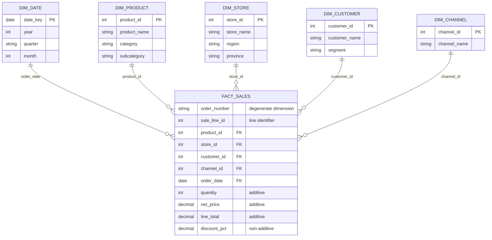

# Board Brief -- S02 : Première étoile
## Question du CEO
**Question du CEO :** Quelles catégories de produits déclinent dans quelles régions, par trimestre ? et pourquoi?

## Grain statement

**1 ligne = 1 ligne de commande** identifiée par `(order_number, sale_line_id)`, concernant un produit, effectuée par un client, dans un magasin, via un canal de vente, à une date donnée.

## Etoile construite



- **5 dimensions conformes** reliées par FK à `fact_sales` :dim_date,dim_product, dim_store, dim_channel,dim_customer
- Mesures : `quantity` (additive), `net_price` (additive), `line_total` (additive), `discount_pct` (non-additive -> moyenne pondérée)

### Comment générer ce diagramme avec votre assistant IA

Collez un prompt comme celui-ci dans Copilot Chat :

> *« Génère un diagramme Mermaid `erDiagram` pour mon étoile NexaMart.
> Au centre : `FACT_SALES` au grain « une ligne de commande »
> (`order_number` + `sale_line_id`), avec les mesures `quantity`, `net_price`,
> `line_total`, `discount_pct`. Cinq dimensions reliées par FK :
> `dim_date`, `dim_product`, `dim_store`, `dim_customer`, `dim_channel`.
> Inclus le bloc dans un fichier Markdown. »*

## SQL preuve

```sql
SELECT
    p.category,
    s.region,
    d.quarter,
    SUM(f.line_total)   AS total_revenue,
    COUNT(*)             AS nb_lignes
FROM fact_sales f
JOIN dim_product p ON f.product_key = p.product_key
JOIN dim_store   s ON f.store_key   = s.store_key
JOIN dim_date    d ON f.date_key    = d.date_key
GROUP BY p.category, s.region, d.quarter
ORDER BY total_revenue DESC
LIMIT 10;
```


|    category     | region  | quarter | total_revenue | nb_lignes |
|-----------------|---------|--------:|--------------:|----------:|
| Pet Supplies    | Québec  | 4       | 10982.23      | 28        |
| Pet Supplies    | Québec  | 2       | 8361.67       | 21        |
| Automotive      | Québec  | 4       | 7772.03       | 22        |
| Pet Supplies    | Québec  | 3       | 7753.10       | 18        |
| Beauty & Health | Québec  | 2       | 7478.66       | 27        |
| Toys & Games    | Québec  | 4       | 7374.96       | 25        |
| Pet Supplies    | Québec  | 1       | 7162.66       | 18        |
| Books & Media   | Québec  | 2       | 6536.74       | 23        |
| Pet Supplies    | Ontario | 3       | 6518.95       | 18        |
| Books & Media   | Québec  | 4       | 6137.86       | 20        |

**Vérifiaction du déclin en comparant  un trimestre avec le trimestre précédent**

```sql
WITH revenue_by_quarter AS (
    SELECT
        p.category,
        s.region,
        d.quarter,
        SUM(f.line_total) AS total_revenue
    FROM fact_sales f
    JOIN dim_product p ON f.product_key = p.product_key
    JOIN dim_store   s ON f.store_key   = s.store_key
    JOIN dim_date    d ON f.date_key    = d.date_key
    GROUP BY p.category, s.region, d.quarter
),
with_previous AS (
    SELECT
        category,
        region,
        quarter,
        total_revenue,
        LAG(total_revenue) OVER (
            PARTITION BY category, region
            ORDER BY quarter
        ) AS previous_revenue
    FROM revenue_by_quarter
)
SELECT
    category,
    region,
    quarter,
    previous_revenue,
    total_revenue,
    total_revenue - previous_revenue AS revenue_change
FROM with_previous
WHERE previous_revenue IS NOT NULL
ORDER BY revenue_change ASC
LIMIT 10;
```
|     category      |  region   | quarter | previous_revenue | total_revenue | revenue_change |
|-------------------|-----------|--------:|-----------------:|--------------:|---------------:|
| Automotive        | Outaouais | 3       | 4435.73          | 623.01        | -3812.72       |
| Automotive        | Ontario   | 2       | 4807.25          | 1009.37       | -3797.88       |
| Grocery           | Ontario   | 2       | 4069.97          | 1137.70       | -2932.27       |
| Pet Supplies      | Outaouais | 4       | 3092.63          | 503.72        | -2588.91       |
| Sports & Outdoors | Estrie    | 2       | 2234.77          | 260.11        | -1974.66       |
| Automotive        | BC        | 4       | 2990.59          | 1023.22       | -1967.37       |
| Toys & Games      | Ontario   | 2       | 3779.99          | 1896.05       | -1883.94       |
| Books & Media     | Ontario   | 4       | 4573.71          | 2752.69       | -1821.02       |
| Beauty & Health   | Ontario   | 4       | 5539.01          | 3729.82       | -1809.19       |
| Toys & Games      | Outaouais | 4       | 2700.90          | 979.88        | -1721.02       |

## Réponse au CEO

Les revenus les plus élevés sont concentrés au **Québec**, notamment pour **Pet Supplies**, **Automotive**, **Beauty & Health** et **Toys & Games**. L’Ontario apparaît aussi dans les meilleures combinaisons, mais de façon moins dominante.

Cependant les regions  **Outaouais**, **Ontario**, **Estrie**, et **BC** montrent des déclins de revenus dans  les trimestres Q3, Q2 et Q4 pour les catégories de produits **Pet Supplies**, **Automotive**, **grocery**, **Sports & Outdoors** et **Toys & Games**

## Validation
création des tables de dimensions et de la table de fait avec des scripts .sql
## Risques / limites
Manque d'informations directement liées à la table de fait pour expliquer les raison du déclin
## Prochaine recommandation
**Recommandation :** prioriser une analyse complémentaire sur les régions BC, Estrie et Outaouais pour vérifier si la baisse est liée à la saisonnalité, aux remises, aux canaux de vente ou aux retours.