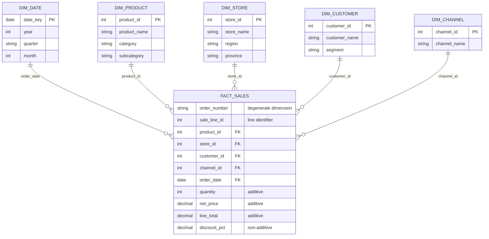

# Board Brief -- S02 : Première étoile

**Question du CEO :** Quelles catégories de produits déclinent dans quelles régions, par trimestre ? et pourquoi?

## Grain statement

**1 ligne = 1 ligne de commande** identifiée par `(order_number, sale_line_id)`, concernant un produit, effectuée par un client, dans un magasin, via un canal de vente, à une date donnée.

## Etoile construite

