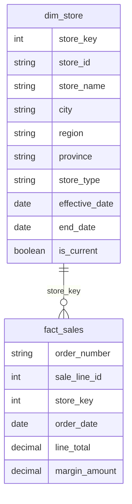

# S03 -- Schema SCD Type 2 pour `dim_store`

Ce document precise le pattern SCD Type 2 utilise pour conserver la verite historique lorsqu'un magasin NexaMart change de region.

## Objectif

Le scenario S03 simule le passage du magasin Gatineau (`STR-004`) de la region `Outaouais` a la region `Quebec` a partir du `2026-03-01`.

Le but du Type 2 est de garder les ventes historiques associees a l'ancienne region, tout en creant une nouvelle version du magasin pour les rapports futurs.

## Diagramme ER



## Lecture des cles

| Colonne | Role |
|---|---|
| `store_id` | Cle naturelle du magasin reel. Elle reste stable pour Gatineau (`STR-004`). |
| `store_key` | Cle substitut. En SCD Type 2, elle identifie une version precise du magasin. |
| `fact_sales.store_key` | Cle etrangere vers la version de `dim_store` valide au moment de la vente. |
| `effective_date` | Date de debut de validite d'une version. |
| `end_date` | Date de fin de validite d'une version. `NULL` indique une version ouverte. |
| `is_current` | Indique la version active du magasin. Une seule version courante doit exister par `store_id`. |

## Exemple Gatineau

Apres simulation Type 2, le magasin Gatineau doit avoir deux versions :

| store_id | store_name | region | effective_date | end_date | is_current |
|---|---|---|---|---|---:|
| STR-004 | NexaMart Gatineau | Outaouais | 2025-01-01 | 2026-02-28 | false |
| STR-004 | NexaMart Gatineau | Quebec | 2026-03-01 | NULL | true |

Les ventes historiques conservent l'ancienne `store_key`, donc elles restent attribuees a `Outaouais`. La nouvelle version `Quebec` sert aux transactions a partir du `2026-03-01`.

## Regles d'integrite SCD

- Une seule version courante (`is_current = true`) doit exister par `store_id`.
- `end_date` ne doit jamais etre inferieure a `effective_date`.
- Les periodes d'une meme cle naturelle ne doivent pas se chevaucher.
- Les faits doivent toujours pointer vers une `store_key` existante.
- Les rapports par region doivent verifier que `region` n'est pas `NULL`.

## Traitement des regions NULL

Le rapport regional doit documenter le traitement des regions manquantes. Dans l'execution S03 validee, aucune ligne de fait ne rejoint une region `NULL`.

Controle recommande :

```sql
SELECT
    'null_region_in_sales_report' AS check_name,
    COUNT(*) AS null_region_rows,
    CASE WHEN COUNT(*) = 0 THEN 'PASS' ELSE 'FAIL' END AS result
FROM fact_sales f
JOIN dim_store s
    ON f.store_key = s.store_key
WHERE s.region IS NULL;
```

Resultat attendu : `null_region_rows = 0`.

Si une region `NULL` apparait, elle doit etre isolee dans un groupe `Unknown` ou corrigee dans `dim_store` avant publication du rapport.
