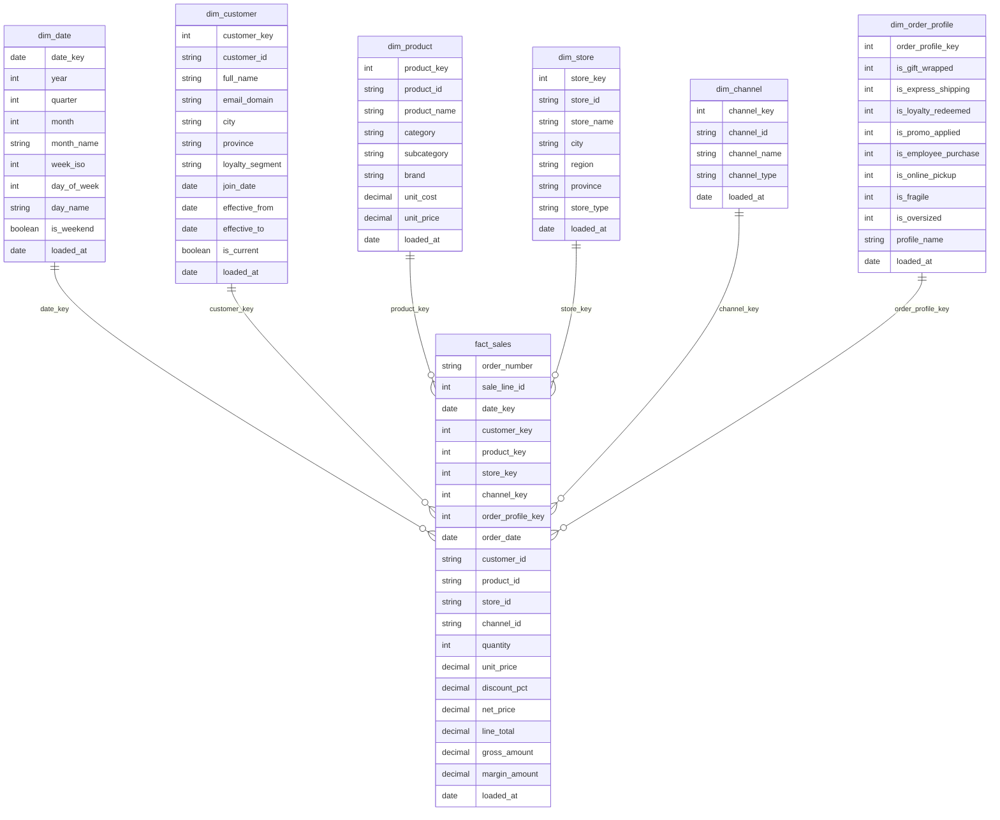

# Schema v2 -- NexaMart S04

Ce schema documente le modele apres la seance S04. Il ajoute la dimension junk `dim_order_profile` et conserve `order_number` dans `fact_sales` comme dimension degeneree.

## Diagramme ER

## Decisions de modelisation

- Le grain de `fact_sales` reste une ligne de commande, identifiee par `(order_number, sale_line_id)`.
- `order_number` est une dimension degeneree : il reste directement dans `fact_sales`, car il n'a pas d'attributs descriptifs propres.
- `dim_order_profile` est une junk dimension : elle regroupe les 8 drapeaux operationnels de commande.
- Les 8 drapeaux ne sont pas stockes directement dans `fact_sales`.
- `fact_sales` reference la junk dimension avec `order_profile_key`.
- `profile_name` rend les combinaisons de flags lisibles pour les operations, par exemple `standard_order` ou `gift_wrapped + loyalty_redeemed`.

## Grain des tables S04

| Table | Grain | Cle principale / identifiant |
|---|---|---|
| `fact_sales` | Une ligne de commande | `(order_number, sale_line_id)` |
| `dim_order_profile` | Une combinaison distincte des 8 flags | `order_profile_key` |
| `dim_product` | Un produit | `product_key` |
| `dim_customer` | Un client | `customer_key` |
| `dim_store` | Un magasin | `store_key` |
| `dim_channel` | Un canal de vente | `channel_key` |
| `dim_date` | Une date calendrier | `date_key` |

## Validation S04

Les controles suivants ont ete executes apres ajout de `order_profile_key` dans `fact_sales` :

| Controle | Resultat |
|---|---:|
| Lignes dans `fact_sales` | 2 147 |
| Commandes distinctes dans `fact_sales` | 667 |
| Profils utilises dans `fact_sales` | 95 |
| `order_profile_key` nulles | 0 |
| Profils observes dans `dim_order_profile` | 97 |
| Doublons au grain `(order_number, sale_line_id)` | 0 |
| Cles `order_profile_key` orphelines | 0 |

## Lecture du modele

Le modele permet deux analyses S04 :

- profils operationnels : `fact_sales` rejoint `dim_order_profile` par `order_profile_key` ;
- analyse de panier : `fact_sales` est auto-jointe sur `order_number` pour trouver les produits achetes ensemble.
